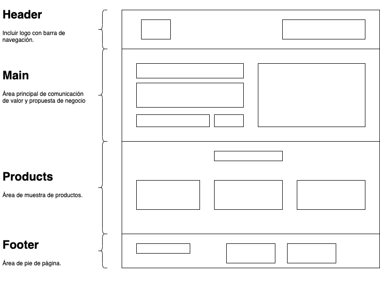

     
# PROYECTO 3: Landing de Negocio

## **ÍNDICE**

* [1. Intro](#1-intro)
* [2. Demo](#2-demo)
* [3. ¿Qué construirás?](#3-qu%C3%A9-construir%C3%A1s)
* [4. Objetivos de Aprendizaje](#4-objetivos-de-aprendizaje)
* [5. Requisitos](#5-requisitos-y-entregables)
* [6. Criterios de evaluación](#6-criterios-de-evaluaci%C3%B3n)
* [7. Entregas](#7-entregas)

****

## 1. Intro

Los sitios web estáticos han crecido en popularidad estos últimos años. 

Existen muchas aplicaciones como [Wix](https://wix.com), [Weebly](https://weebly.com) o [Squarespace](https://squarespace.com) que han aprovechado este crecimiento debido a la gran necesidad de empresas de  mostrar sus propuestas de valor, a Internet, para presentar sus productos al mundo.

Hay un segmento del mercado que necesita mucha personalización, ya sea porque más adelante incluirá un sistema de registro, un área para clientes, etc. 

Es aquí donde es recomendable construirlo de manera más personalizada, sin usar servicios de terceros. 

Por ello, en este proyecto, realizaremos un sitio web personalizado con HTML y CSS.

****

## 2. Demo

Accede a la sección de la demo: [LINK](https://github.com/UDDBootcamp/7M_FULLSTACK_M3_PROY/tree/master/demo)

En esta, realizamos una página de aterrizaje, también conocida como `landing`, el cual el usuario al acceder a la página puede observar la interfaz y comprender de qué trata el negocio y sus productos.

La idea es que uses esta demo para guiar tu proyecto y puedas realizar un proceso similar. Puedes también ocupar el código para trabajar el tuyo.

****

## 3. ¿Qué construirás?

Este proyecto está enfocado en construir una página `landing` para un negocio.

Se te pide que sea una sola página que permita establecer:

- Realizar un prototipado simple, en papel o utilizando un programa de dibujo, sobre cómo trabajarás tu sitio. Podrías utilizar [https://draw.io]() si quieres evaluar una herramienta gratuita, fácil y confiable.
- Muestra de los mensajes de negocio
- Breve catálogo de productos
- Incluir estas secciones en la interfaz:
  - **a. Header**
    Sección que involucra el logo y las áreas principales del sitio.
  - **b. Main**
    Sección de presentación del producto al usuario. Debe de incluir su título, descripción y un elemento para introducir tu correo.
  - **c. Products**
    Sección para mostrar los artículos del sitio web. O en su caso, artículos de catálogo de productos
  - **d. Footer**
    Sección que incluye todas las áreas del sitio, incluyendo redes sociales.
- De manera opcional y recomendada, que la vista se adapte a móviles

A continuación, conoce las secciones en este dibujo, en formato de prototipado simple:

****

## 4. Objetivos de aprendizaje

El objetivo principal de este proyecto es desarrollar una interfaz utilizando HTML y CSS, en toda su aplicación.

Aplicarás:

- Prototipado simple.
- Etiquetas estándar HTML5.
- CSS. Puedes elegir uno de los siguientes métodos:
    a) Un archivo `index.css` en el cual se establezcan todos los estilos
    b) Incluir los estilos directamente en el archivo `HTML`, usando la etiqueta ``.
    c) Usar un framework como [TailwindCSS](https://tailwindcss.com), [Bootstrap](https://getbootstrap.com/), o [Bulma](https://bulma.io/), para ejecutar clases CSS eficientemente.

****

## 5. Requisitos y entregables

Usa esta lista para saber los requisitos mínimos del proyecto:

### GENERAL

- [ ] Realizarse de manera individual

### UI
- [ ] Desarrollar prototipado simple.
- [ ] Aplicar en todo el sitio HTML5
- [ ] Aplicar estilos CSS.
- [ ] Sección `Header`
- [ ] Sección `Main`
- [ ] Sección `Products`
- [ ] Sección `Footer`
- [ ] Opcional. Responsive Web Design (Vista en móviles con uso de media queries)

### CONTROL DE VERSIONES
- [ ] Crear un repositorio en GitHub
- [ ] Colocar descripción dentro del repositorio

### ENTREGA A TIEMPO
- [ ] Entregar a tiempo el proyecto.

### DESPLIEGUE [OPCIONAL]
- [ ] Crear una URL para compartir (puedes utilizar Netlify o GitHub Pages)

## 6. Criterios de evaluación

A partir de los requisitos, tu % estará definido de esta forma:

| ÁREA       | % DEL TOTAL |
| ------------- |:-------------:|
| UI      | 70%     |
| CONTROL DE VERSIONES      | 15%     |
| ENTREGA A TIEMPO | 15%      |

****

## 7. Entregas

- **Definición de fechas.** Habla con tus coaches sobre el periodo de entregas del proyecto.

- **Cumple con los requisitos y entregables.** Debes verificar que cumplas con todo lo que listamos en esta sección y tomes en cuenta el tiempo establecido para ello, ya que de esto depende que obtengas tu insignia.
