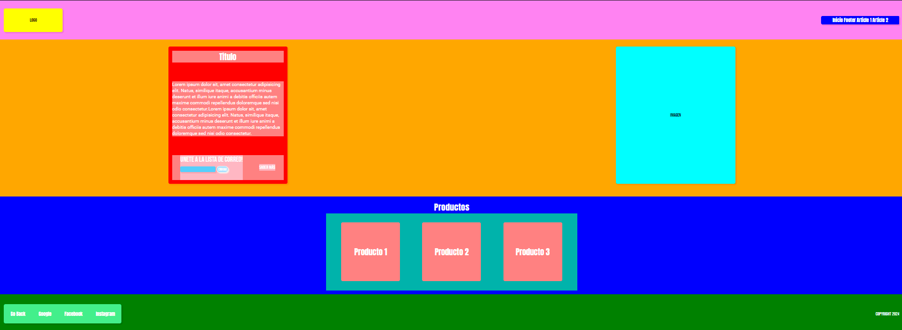

     
# PROYECTO 3: Landing de Negocio

## **ÍNDICE**

* [1. Intro](#1-intro)
* [2. Demo](#2-demo)
* [3. ¿Qué construirás?](#3-qu%C3%A9-construir%C3%A1s)
* [4. Objetivos de Aprendizaje](#4-objetivos-de-aprendizaje)
* [5. Requisitos](#5-requisitos-y-entregables)
* [6. Criterios de evaluación](#6-criterios-de-evaluaci%C3%B3n)
* [7. Entregas](#7-entregas)

****

## 1. Intro

El proyecto numero 3 corresponde al diseño y maquetación de un sitio tipo landing page utilizando HTM5 y CSS3 de forma básica para demostrar los conocimientos adquiridos en clases.

****

## 2. Demo

Accede al código fuente del sitio tanto en su archivo .html como su hoja de estilos .css: 
[LINK](https://github.com/UDDBootcamp/7M_FULLSTACK_M3_PROY/tree/master/demo)

En este código, se realizó una página de aterrizaje, también conocida como `landing`, en cual el usuario al acceder a la página puede observar la interfaz y comprender de qué trata el negocio y sus productos.

El esquema del sitio corresponde a:

****

## 3. ¿Qué se construyó? 

Este proyecto se enfocó en construir una página `landing` esquematizada en colores para una mejor compresión de los elementos del sitio.

Es una sola página que permite establecer:

- Se realizó un prototipado simple, en Photoshop con la herramienta Section Tool.
- Se muestran los espacios/cajas para los mensajes de negocio.
- Espacio para breve catálogo de productos.
- Se incluyen estas secciones en la interfaz:
  - **1. Header**
    Sección que incluye el logo y la barra de navegación del sitio.
  - **2. Main**
    Sección de presentación del producto al usuario. Incluye su título, descripción y un elemento para introducir tu correo.
  - **3. Products**
    Sección para mostrar los artículos del sitio web. 3 para este caso, artículos de catálogo de productos
  - **4. Footer**
    Sección que incluye todas las áreas del sitio, incluyendo redes sociales.
- Incluye vista que se adapta a móviles 768px de ancho o menor mediante Media Queries

A continuación, las secciones en este dibujo, en formato de prototipado simple:

****

## 4. Objetivos de aprendizaje

El objetivo principal de este proyecto fue desarrollar una interfaz utilizando HTML y CSS, en toda su aplicación.

Se Aplicarón:

- Prototipado simple.
- Etiquetas estándar HTML5.
- CSS. Se eligió el siguiente método:
    a) Un archivo `style.css` en el cual se establezcan todos los estilos
    Nota. No se Utilizaron frameworks.

****

## 5. Requisitos y entregables

Según esta lista estos son los requisitos mínimos del proyecto:

### GENERAL

- [OK] Realizarse de manera individual

### UI
- [OK] Desarrollar prototipado simple.
- [OK] Aplicar en todo el sitio HTML5
- [OK] Aplicar estilos CSS.
- [OK] Sección `Header`
- [OK] Sección `Main`
- [OK] Sección `Products`
- [OK] Sección `Footer`
- [OK] Opcional. Responsive Web Design (Vista en móviles con uso de media queries)

### CONTROL DE VERSIONES
- [OK] Crear un repositorio en GitHub
- [OK] Colocar descripción dentro del repositorio

### ENTREGA A TIEMPO
- [OK] Entregar a tiempo el proyecto.

### DESPLIEGUE [OPCIONAL]
- [NO REALIZADO] Crear una URL para compartir (puedes utilizar Netlify o GitHub Pages)

## 6. Criterios de evaluación

A partir de los requisitos, tu % estará definido de esta forma:

| ÁREA       | % DEL TOTAL |
| ------------- |:-------------:|
| UI      | 70%     |
| CONTROL DE VERSIONES      | 15%     |
| ENTREGA A TIEMPO | 15%      |

****

## 7. Entregas

- **Definición de fechas.** Habla con tus coaches sobre el periodo de entregas del proyecto.

- **Cumple con los requisitos y entregables.** Debes verificar que cumplas con todo lo que listamos en esta sección y tomes en cuenta el tiempo establecido para ello, ya que de esto depende que obtengas tu insignia.
